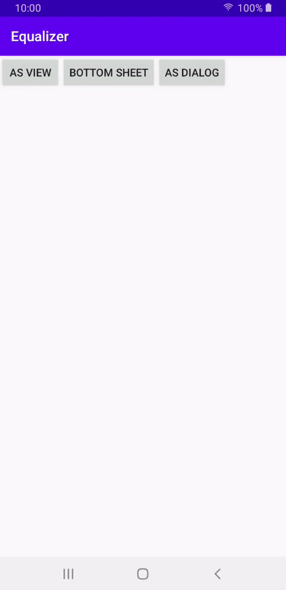
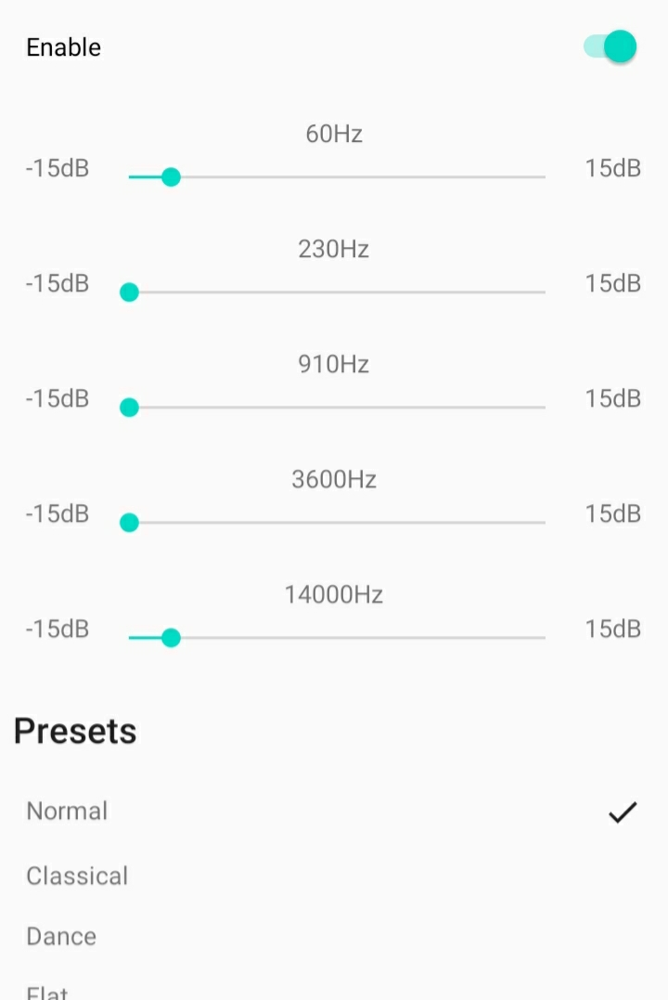
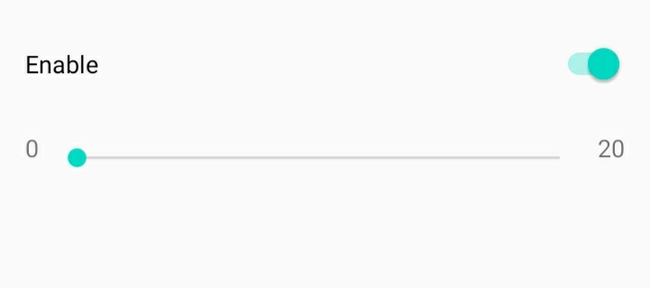

## Audio Effect Manager
----
Add Audio Effects Feature on your Music App very easy and quick.

### Preview


----
### Installation
Add it in your root build.gradle at the end of repositories:
````groovy
allprojects {
	repositories {
		maven { url 'https://jitpack.io' }
	}
}
````
Add the dependency
````groovy
dependencies {
    implementation 'com.github.xeinebiu:audioeffects:1.0.0'
}
````

----
### Audio Session Id
You can read the Session Id of your Audio from the MediaPlayer
````kotlin
val audioSessionId = this.mediaPlayer.audioSessionId
````

----
### AudioEffectManager
After we have the ``audioSessionId``, we create `AudioEffectManager`
Here you will find `equalizer` and `bass boost`.
````kotlin
val audioEffectManager = AudioEffectManager(audioSessionId)
````

----
### Views
To help you more, on this library, we have created simple UI to work with the `AudioEffectManager`
#### Equalizer View
A view to work only with the Equalizer
````kotlin
val view = EqualizerView(requireContext(), parent, audioEffectManager).createView()
parent.addView(view)
````
 

#### Bass View
A view to work only with Bass Boost
````kotlin
val view = BassView(requireContext(), parent, audioEffectManager).createView()
parent.addView(view)
````
 

### AudioEffectViewHelper
A helper to create views for us as Dialog, Bottom Sheet or Child View.
It creates a Tabbed Layout with the `equalizer` and `bass` view's.
````kotlin
val audioEffectViewHelper = AudioEffectViewHelper(
    this,
    supportFragmentManager,
    audioEffectManager
)
// show the tabbed layout as dialog
audioEffectViewHelper.showAsDialog()
audioEffectViewHelper.showAsBottomSheet()

// add the tabbed layout on specific container
val audioEffectView = audioEffectViewHelper.asView(container)
container.addView(audioEffectView)
````

### Release
Releasing the AudioEffectManager must be done when not needed.
````kotlin
override fun onDestroy() {
    super.onDestroy()
    mediaPlayer.stop()
    mediaPlayer.release()
    audioEffectManager.release()
}
````

----
##### Follow the demo application for more Usage Examples

#### Author
> xeinebiu
